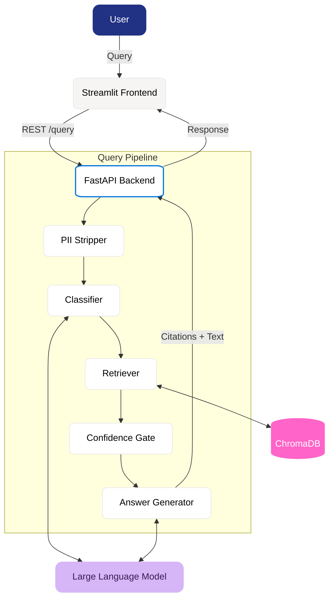

# 🏛️ IP-SAKTI Sahayak

<div align="center">

[](https://www.python.org)
[](https://fastapi.tiangolo.com)
[](https://streamlit.io)
[](#)
[](#)
[](https://opensource.org/licenses/MIT)

**An AI-powered Intellectual Property advisory system for Traditional Knowledge, Ayurveda, and Biological Resources. Built for India. 🇮🇳 (SIH 2026 | PS-26045)**

[Features](#-key-features) • [Architecture](#-architecture) • [Design System](#-notion-inspired-design) • [Quickstart](#-quickstart-local-development) • [Epics](#-project-structure--execution)

</div>

---

IP-SAKTI Sahayak provides inventors, researchers, and MSMEs with accurate, citation-backed answers to complex IP questions. Unlike general-purpose LLMs, this system relies on a **strict RAG architecture** (Retrieval-Augmented Generation) constrained to an official, curated corpus of Indian law — guaranteeing zero hallucinations.

## ✨ Key Features

- **🛡️ Anti-Hallucination Pipeline**: The AI can *only* answer using retrieved legal documents. Every sentence is backed by a verifiable citation linking to the exact source.
- **🧬 ABS Detection**: Automatically flags queries involving biological resources that require Access and Benefit Sharing (ABS) compliance under the Biological Diversity Act 2023.
- **💭 Honest Abstention**: If the answer isn't in the corpus, the system confidently says "I don't know" instead of guessing.
- **🔒 Privacy by Design (DPDP Act)**: Strips PII (Personal Identifiable Information) from all queries before logging. No user data is stored.


## 🏗️ Architecture

We rely on a deterministic, testable pipeline rather than "LLM magic".



| Component | Technology | Purpose |
|---|---|---|
| **Backend** | `FastAPI` | High-performance, async-first orchestration |
| **Vector DB** | `ChromaDB` | Fast semantic search (local, no cloud dependency) |
| **LLM Engine** | `Any LLM` | Fast, structured generation via your preferred provider |
| **Embeddings** | `BAAI/bge-small` | Converts legal text chunks into searchable vectors |
| **Frontend** | `Streamlit` | Rapid UI iteration mapped to `DESIGN.md` |

## 🚀 Quickstart (Local Development)

We designed the development environment to be beginner-friendly. **No Docker is required.** Everything runs in a standard Python virtual environment.

### 1. Automated Setup (Recommended)

Run the automated setup script from the root directory. It creates `.venv`, installs all dependencies, and creates your `.env` file:

**Windows:**
```cmd
scripts\setup.bat
```

**Mac / Linux:**
```bash
chmod +x scripts/*.sh *.sh
./scripts/setup.sh
```

<details>
<summary>Manual Setup Steps (Alternative)</summary>

```bash
# 1. Create and activate a Python virtual environment (Python 3.11+)
python -m venv .venv

# Activate on Mac/Linux:
source .venv/bin/activate
# Activate on Windows:
.venv\Scripts\activate

# 2. Install dependencies
pip install --upgrade pip
pip install -r requirements.txt
pip install -r requirements-dev.txt

# 3. Configure environment file
cp .env.example .env
```
</details>

### 2. Configure Secrets
Open the `.env` file and add your LLM API key (`GEMINI_API_KEY`).

### 3. Run the System
The helper scripts automatically activate the `.venv` and load `.env` for you:

**Terminal 1 (Backend API):**
- **Windows:** `run_api.bat`
- **Mac / Linux:** `./run_api.sh`
- *API runs on `http://localhost:8000` (docs at `http://localhost:8000/docs`)*

**Terminal 2 (Frontend UI):**
- **Windows:** `run_frontend.bat`
- **Mac / Linux:** `./run_frontend.sh`
- *UI runs on `http://localhost:8501`*

### 4. Running Tests & Linting
- **Run Tests:** `run_tests.bat` (Windows) or `./run_tests.sh` (Mac/Linux)
- **Check Linting:** `python -m ruff check src/ tests/`
- **Format Code:** `python -m black src/ tests/`

> 📖 For full contribution guidelines, GitFlow branching rules, and troubleshooting common errors, see **[CONTRIBUTING.md](CONTRIBUTING.md)**.

## 🗺️ Project Structure & Execution

We have decomposed the project into **6 Epics** and **35 modular GitHub Issues**. Every issue has clear acceptance criteria and is ready to be picked up by the team.

- 🧰 **Epic 0: Dev Setup & CI/CD** (Issues #19-23) — Environments, Actions, linting.
- 📚 **Epic 1: Legal Corpus** (Issues #1-6, 32-33) — Official ingestion, chunking, ChromaDB.
- 🧠 **Epic 2: Query Pipeline** (Issues #7-11, 34) — Classification, ABS checker, confidence gate.
- 📝 **Epic 3: Answer & Privacy** (Issues #12-14) — Citation grounding, PII stripping.
- 🎯 **Epic 4: Demo Readiness** (Issues #15-18, 35) — Golden test sets, compliance audits.
- 🎨 **Epic 5: UX/UI Design** (Issues #24-31) — Implementation of `DESIGN.md`.

---

<div align="center">
  <p>Built with 🩵 for <strong>SIH 2026</strong>. Designed for impact.</p>
</div>
