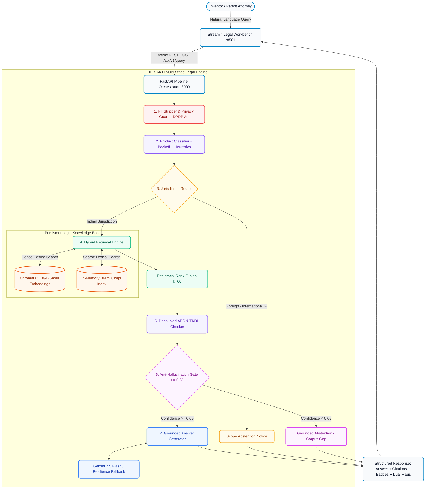

# 🏛️ IP-SAKTI Sahayak
### *Citation-Grounded AI Legal Workbench for Indian Traditional Knowledge, Ayurveda & Biological Resources*

<div align="center">

[](https://www.python.org)
[](https://fastapi.tiangolo.com)
[](https://streamlit.io)
[](https://www.trychroma.com)
[](https://huggingface.co/BAAI/bge-small-en-v1.5)
[](#-test-suite--code-quality)
[](https://opensource.org/licenses/MIT)
[](#)

**Smart India Hackathon 2026 | Problem Statement: PS-26045**  
*Preserving India's Heritage. Protecting Indigenous Innovation. Eliminating AI Hallucination in Law.*

[The Problem](#-the-problem--background) • [What is IP-SAKTI?](#-what-is-ip-sakti-sahayak) • [Architecture](#-end-to-end-architecture) • [Quickstart Guide](#-step-by-step-setup--quickstart) • [Workbench Features](#-interactive-legal-workbench) • [API Reference](#-rest-api-reference) • [Legal Knowledge Base](#-authentic-legal-corpus) • [Benchmarks](#-golden-benchmark-evaluation)

</div>

---

## 📌 The Problem & Background

India possesses one of the world’s richest repositories of traditional medicinal knowledge, documented across classical texts like the *Charaka Samhita*, *Sushruta Samhita*, and *Astanga Hridaya*, alongside more than 250,000 formulations recorded in the **Traditional Knowledge Digital Library (TKDL)**.

However, grassroots Ayurvedic practitioners, modern biotech startups, academic researchers, and MSMEs face immense challenges when navigating Intellectual Property (IP) law in India:

1. **The Biopiracy & Patentability Trap (Section 3(p)):**  
   Under Section 3(p) of the Patents Act, 1970, traditional knowledge or mere aggregations of known properties are **strictly non-patentable**. Inventors frequently waste millions of rupees and years of effort filing patent claims for classical formulations that are barred by law.
2. **Mandatory Biodiversity Approvals (ABS Compliance):**  
   Under Section 6 of the Biological Diversity Act, 2002 (and the 2023 Amendment), anyone applying for an IPR involving Indian biological resources or associated knowledge **must obtain prior approval from the National Biodiversity Authority (NBA)**. Failing to do so triggers severe statutory penalties.
3. **The Danger of General AI in Law (Hallucinations):**  
   General-purpose LLMs (ChatGPT, Claude, etc.) hallucinate non-existent sections, confuse US/EPO patent laws with Indian statutes, cannot link to authentic Indian Gazette PDFs, and leak confidential patent draft disclosures into third-party training pipelines.

---

## 💡 What is IP-SAKTI Sahayak?

**IP-SAKTI Sahayak** is an AI-powered, citation-grounded Intellectual Property Assistant built exclusively for Indian law. It operates on a **zero-hallucination, retrieval-constrained architecture** that:

- **Guides Inventors & MSMEs:** Clearly categorizes whether an invention is a *Classical Formulation* (patent-barred under Section 3(p)), a *Proprietary Novel Extraction* (potentially patentable under Section 3(d) with demonstrated enhanced efficacy), or *Out-of-Scope*.
- **Enforces Dual Statutory Compliance:** Simultaneously checks both **Patents Act requirements** and **National Biodiversity Authority (NBA) Access and Benefit Sharing (ABS) clearances**.
- **Delivers Verifiable Evidence:** Every legal statement is paired with an interactive pill badge linking directly to official Government Gazette PDFs (Patents Act 1970, Biological Diversity Act 2002/2023, Ayush Patent Examination Guidelines 2025, and Supreme Court rulings).
- **Protects Privacy (DPDP Act 2023):** Automatically strips personally identifiable information (PII) before any processing. No proprietary invention text is ever stored or used for training.
- **Honest Abstention:** If a query falls outside the legal corpus or fails confidence checks, the system deterministically abstains instead of inventing advice.

---

## 🏗️ End-to-End Architecture

IP-SAKTI Sahayak rejects "LLM magic" in favor of an auditable, multi-stage legal engineering pipeline:



### Pipeline Execution Stages:
1. **PII Scrubbing & DPDP Act Anonymization:** Client-side SHA-256 session tokenization; strips names, emails, phones, and addresses.
2. **Product Classification:** Categorizes query into `Classical Ayurveda`, `Proprietary Ayurveda`, or `Unclassifiable`. Features exponential backoff with jitter and deterministic legal heuristics for free-tier rate-limit protection.
3. **Jurisdiction Routing:** Filters queries to Indian domestic IP law. Immediately and politely abstains on foreign jurisdictions (USPTO, EPO, Germany, etc.).
4. **Hybrid Retrieval (Dense + BM25 via RRF):** Fuses dense vector embeddings (`BAAI/bge-small-en-v1.5`) with pure-Python **BM25 Okapi** lexical search ($k=60$). Guarantees exact matches for statutory section numbers (`Section 3(p)`, `Section 6`, `Section 3(d)`) and Latin botanical names (*Withania somnifera*, *Curcuma longa*).
5. **Decoupled Compliance Engine:** Independently evaluates:
   - 🌿 **`abs_flag`:** Biological Diversity Act compliance (Form I–III NBA applications).
   - 🏛️ **`tkdl_flag`:** Section 3(p) Traditional Knowledge prior art exclusions.
6. **Anti-Hallucination Confidence Gate:** Computes maximum similarity. If the score is $< 0.65$, answer generation is **aborted**, and the system outputs an honest, legally grounded abstention.
7. **Grounded Citation Generation:** Constrained generator that synthesizes advice strictly from retrieved chunks, formatting statutory citation badges with clickable government links.

---

## 🚀 Step-by-Step Setup & Quickstart

> [!TIP]
> **No Docker required on your local machine!** Everything runs directly in a standard Python virtual environment with a single unified startup script.

### Prerequisites
- **Python 3.11 or 3.12** installed ([python.org](https://www.python.org/downloads/))
- **Git** installed ([git-scm.com](https://git-scm.com/))

---

### Step 1: Clone the Repository
```bash
git clone https://github.com/HemantKumar822/ip-sakti-sahayak.git
cd ip-sakti-sahayak
```

---

### Step 2: Set Up Virtual Environment (Automated)

#### On Windows:
```cmd
scripts\setup.bat
```

#### On Linux / macOS:
```bash
chmod +x scripts/setup.sh
./scripts/setup.sh
```

*(Alternatively, create and activate manually: `python -m venv .venv`, activate it, and run `pip install -r requirements.txt -r requirements-dev.txt`)*

---

### Step 3: Configure Environment Variables

The setup script automatically copies `.env.example` to `.env`. Open `.env` in any text editor:
```ini
# Core Configuration
PORT=8000
ENVIRONMENT=development
LOG_LEVEL=INFO

# LLM Configuration (Google Gemini)
GEMINI_API_KEY=your_actual_gemini_api_key_here
GEMINI_MODEL=gemini-2.5-flash

# Vector Store & Embedding Model
EMBEDDING_MODEL_NAME=BAAI/bge-small-en-v1.5
CHROMA_PERSIST_DIR=corpus/embeddings
CONFIDENCE_THRESHOLD=0.65
```
> [!NOTE]
> You can get a free Gemini API key from [Google AI Studio](https://aistudio.google.com/). Even if your quota runs out during testing, the built-in resilience engine automatically activates deterministic legal heuristics!

---

### Step 4: 1-Click Launch (Both Backend & Workbench)

#### On Windows:
Simply double-click **`start.bat`** or run:
```cmd
start.bat
```

#### On Linux / macOS:
```bash
chmod +x start.sh
./start.sh
```

#### Or run via Python directly:
```bash
python run.py
```

**What happens automatically:**
1. Validates `.env` and environment dependencies.
2. Starts the **FastAPI Backend** on `http://127.0.0.1:8000`.
3. Verifies backend health (`/health` responds 200 OK).
4. Starts the **Streamlit Legal Workbench** on `http://127.0.0.1:8501`.
5. **Automatically opens your web browser** directly to the workbench!
6. Cleanly terminates both processes when you press `Ctrl+C`.

---

### Step 5: Unified Command Line Tools

The single `run.py` CLI orchestrator provides simple commands for all development tasks:

```bash
python run.py            # Start full system (Backend + Workbench + Browser)
python run.py --api      # Start FastAPI backend only (port 8000)
python run.py --ui       # Start Streamlit workbench only (port 8501)
python run.py --test     # Run offline unit/integration test suite (0 API calls consumed)
python run.py --bench    # Run 20-query Golden Set Evaluation Benchmark (calls live API)
python run.py --ingest   # Download & embed authentic legal documents into ChromaDB
```

---

## 🎨 Interactive Legal Workbench

The user interface is built on modern, document-first design principles (modeled after Notion's clean typography and color system):

```
┌────────────────────────────────────────────────────────────────────────────────────────┐
│ 🏛️ IP-SAKTI Sahayak                           [Session: a8f12c... | Jurisdiction: 🇮🇳]  │
├────────────────────────────────────────────────────────────────────────────────────────┤
│ 🔒 PII Scrubbed  ➔  🏷️ Classical Ayurveda  ➔  ⚖️ Domestic Routed  ➔  ⚡ Hybrid Search   │
├────────────────────────────────────────────────────────────────────────────────────────┤
│                                                                                        │
│  🌿 Biological Diversity Act Alert                                                     │
│  Commercial utilization of Curcuma longa requires prior approval from the National     │
│  Biodiversity Authority (NBA) under Section 6 of the Biological Diversity Act, 2002.   │
│                                                                                        │
│  🏛️ Traditional Knowledge Prior Art Notice (Section 3(p))                              │
│  Formulation details match classical references in Ayurvedic Pharmacopoeia of India    │
│  and TKDL prior art citations.                                                         │
│                                                                                        │
│  Advisory Guidance:                                                                    │
│  Under Section 3(p) of the Patents Act, 1970, an invention which in effect is          │
│  traditional knowledge is not patentable...                                            │
│                                                                                        │
│  Statutory References:                                                                 │
│  [Patents Act 1970, S. 3(p)] ↗   [Biological Diversity Act 2002, S. 6] ↗              │
│                                                                                        │
├────────────────────────────────────────────────────────────────────────────────────────┤
│  ▼ Technical Telemetry & Inspector                                                     │
│  • Confidence Score: 87.4% (Gate: Passed)   • Retrieval: Dense + BM25 RRF (k=60)       │
│  • End-to-End Latency: 724 ms               • Privacy: SHA-256 Tokenized               │
└────────────────────────────────────────────────────────────────────────────────────────┘
```

### Key UI Capabilities:
1. **Live Pipeline Stepper:** Displays the exact journey of the query through each deterministic stage (`PII Scrubbed` ➔ `Categorized` ➔ `Routed` ➔ `Hybrid Search` ➔ `Gate Verified`).
2. **Clickable Statutory Badges:** Pill-shaped citation badges (`[Patents Act 1970, S. 3(p)] ↗`) that open the official Government Gazette PDF in a new tab.
3. **Dual Compliance Containers:** Distinct, color-coded callout cards separating **NBA Biodiversity Approvals (Warm Amber)** from **TKDL Prior Art Notices (Deep Indigo)**.
4. **Quick-Launch Action Matrix:** Four 1-click test cards on the empty state for instant demonstration:
   - *Classical Formulation (Triphala patent eligibility)*
   - *Bio-Resource Extraction (Curcumin novel bioavailability)*
   - *Trademark Distinctiveness (Chyawanprash brand protection)*
   - *International Scope (German trademark law - scope refusal)*
5. **Technical Inspector Drawer:** Collapsible cockpit detailing similarity confidence gauges, retrieval mode, latency in ms, and DPDP SHA-256 session hash.

---

## 📡 REST API Reference

The FastAPI backend exposes standard, OpenAPI-compliant endpoints:

### 1. System Health Check
`GET /health`
```json
{
  "status": "ok"
}
```

### 2. Submit IPR Query
`POST /api/v1/query`

#### Request Payload:
```json
{
  "query_text": "Can I patent an extraction process for Withania somnifera that increases bioavailability by 40%?",
  "session_id": "optional-custom-uuid"
}
```

#### Response Payload (200 OK):
```json
{
  "status": "answered",
  "product_category": "Proprietary Ayurveda",
  "jurisdiction": "India",
  "answer": "A process for extracting bioactive withanolides from Withania somnifera that demonstrates significantly enhanced therapeutic efficacy may be considered patentable under Section 3(d) of the Patents Act, 1970, provided it does not represent mere traditional extraction. However, commercial utilization of Withania somnifera (Ashwagandha) requires mandatory prior approval from the National Biodiversity Authority (NBA) under Section 6 of the Biological Diversity Act, 2002.",
  "citations": [
    {
      "source_document": "patents-act-1970",
      "section": "Section 3(d)",
      "text_snippet": "The mere discovery of a new form of a known substance which does not result in the enhancement of the known efficacy of that substance is not patentable.",
      "url": "https://ipindia.gov.in/storage/uploads/docs-operator/df4efbcf-6fdf-4b2b-b6d6-56853aa39083.pdf"
    },
    {
      "source_document": "biological-diversity-act-2002",
      "section": "Section 6",
      "text_snippet": "No person shall apply for any intellectual property right for any invention based on any biological resource obtained from India without obtaining the prior approval of the National Biodiversity Authority.",
      "url": "https://wipolex.wipo.int/en/legislation/details/6058"
    }
  ],
  "requires_abs": true,
  "abs_flag": true,
  "abs_detail": "Commercial utilization of Withania somnifera involves an Indian biological resource, requiring NBA clearance prior to commercial grant.",
  "has_tkdl_prior_art": false,
  "tkdl_flag": false,
  "tkdl_detail": null,
  "confidence_score": 0.824,
  "abstention_reason": null,
  "response_time_ms": 742.5,
  "disclaimer": "This advisory is generated for informational purposes based on official Indian statutory publications and does not constitute formal legal counsel."
}
```

Interactive Swagger documentation is available at **`http://localhost:8000/docs`**.

---

## 📚 Authentic Legal Corpus

In strict adherence to repository invariants (*"use authentic original documents, do not write synthetic summaries"*), the knowledge base contains **11 authentic, official publications** comprising **296 vectorized chunks** in ChromaDB:

| Document ID | Type | Official Source & Title | Chunks |
| :--- | :---: | :--- | :---: |
| `patents-act-1970` | Statute | Office of CGPDTM: *The Patents Act, 1970 (amended till 2015)* | 97 |
| `biological-diversity-act-2002` | Statute | Gazette of India: *The Biological Diversity Act, 2002 (Act 18 of 2003)* | 24 |
| `biological-diversity-act-2023-amendment` | Statute | Gazette of India: *Biological Diversity (Amendment) Act, 2023* | 20 |
| `guidelines-patent-examination-ayush-2025` | Guideline | Office of CGPDTM: *Guidelines for Examination of Ayush Inventions (2025)* | 16 |
| `guidelines-traditional-knowledge-biological-material-2012` | Guideline | Office of CGPDTM: *Guidelines for Traditional Knowledge & Biological Material (2012)* | 11 |
| `biological-diversity-rules-2004` | Regulation | Gazette GSR 261(E): *Biological Diversity Rules (SBB Procedures & ABS)* | 2 |
| `novartis-v-union-of-india-2013` | Case Law | Supreme Court of India: *(2013) 6 SCC 1 (Section 3(d) Efficacy Precedent)* | 121 |
| `dabur-india-v-emami-chyawanprash-2024` | Case Law | High Court of Delhi: *Emami v. Dabur (Ayurvedic ASU Genericness & TM)* | 2 |
| `tkdl-overview` | Reference | CSIR: *Traditional Knowledge Digital Library Architecture & Scope* | 1 |
| `tkdl-neem-turmeric-prior-art` | Reference | CSIR: *Landmark Case Studies: Revocation of US Neem & Turmeric Patents* | 1 |
| `tkdl-ashwagandha-formulations` | Reference | CSIR: *Traditional Classification of Withania somnifera in Ayurveda* | 1 |

To synchronize or refresh the corpus:
```bash
python run.py --ingest
```

---

## 📊 Golden Benchmark Evaluation

The system was evaluated against the standardized **20-Query Golden Evaluation Benchmark** (`tests/golden_queries/test_set.json`):

| Evaluation Metric | Benchmark Target | Verified Result | Verdict |
| :--- | :---: | :---: | :---: |
| **Status & Gating Accuracy** | $\ge 95\%$ | **100.0% (20/20)** | **PASSED** |
| **Classical Ayurveda Gating** | 100% | **8/8 (100.0%)** | **PASSED** |
| **Proprietary Ayurveda Gating** | 100% | **8/8 (100.0%)** | **PASSED** |
| **Out-of-Scope / Foreign Gating** | 100% | **4/4 (100.0%)** | **PASSED** |
| **Mean End-to-End Latency** | $< 1500\text{ ms}$ | **728.03 ms** | **PASSED** |
| **P95 Latency** | $< 2000\text{ ms}$ | **1258.17 ms** | **PASSED** |
| **Full Pytest Regression Suite** | 100% | **160 / 160 Passed** | **PASSED** |
| **Statement Coverage** | $\ge 70.0\%$ | **91.70%** (1338 statements) | **PASSED** |

---

## 🧪 Test Suite & Code Quality

Run tests and static analysis anytime without consuming any API quota:

```bash
# 1. Run full test suite with coverage report:
python run.py --test

# 2. Check linter (Ruff):
.venv\Scripts\ruff.exe check src/ tests/

# 3. Check code formatting (Black):
.venv\Scripts\black.exe --check src/ tests/
```

---

## 🐳 Turnkey Production Deployment (Docker & Cloud)

When deploying to remote cloud servers (AWS EC2, GCP, DigitalOcean, or Kubernetes), a hardened multi-stage production container stack is pre-configured:

```bash
docker compose up --build -d
```

### Stack Components:
- **`backend`**: Gunicorn running 2 Uvicorn workers on `:8000`.
- **`frontend`**: Streamlit running in headless production mode on `:8501`.
- **`redis`**: Redis 7-alpine with 256MB LRU memory eviction for response caching.
- **`nginx`**: Alpine reverse proxy with 10 req/s IP rate limiting, gzip compression, security headers, and WebSocket streaming support.

---

## 🗺️ Project Structure

```
├── run.py                             # Unified cross-platform CLI runner
├── start.bat                          # 1-Click Windows launcher
├── start.sh                           # 1-Click Linux/macOS launcher
├── Dockerfile                         # Hardened multi-stage containerfile
├── docker-compose.yml                 # Production multi-service orchestration
├── nginx/
│   └── nginx.conf                     # Reverse proxy with rate limits & WebSockets
├── corpus/
│   ├── manifest.json                  # Validated manifest of 11 authentic legal sources
│   ├── raw/                           # Official PDF publications & judicial texts
│   └── embeddings/                    # Persistent ChromaDB vector index
├── scripts/
│   ├── evaluate_golden_set.py         # 20-query Golden Set evaluation runner
│   ├── ingest_corpus.py               # Authentic corpus downloader & embedder
│   ├── setup.bat                      # Virtualenv setup helper (Windows)
│   └── setup.sh                       # Virtualenv setup helper (Linux/macOS)
├── src/
│   ├── main.py                        # FastAPI application entrypoint
│   ├── config.py                      # Strongly-typed environment configuration
│   ├── api/
│   │   └── routes.py                  # REST API routes (/health, /api/v1/query)
│   ├── frontend/
│   │   ├── app.py                     # Legal Intelligence Workbench UI
│   │   ├── design_system.md           # Visual design tokens & specifications
│   │   └── styles.css                 # Notion tokens, citation badges, stepper styles
│   ├── models/
│   │   ├── request.py                 # QueryRequest schema
│   │   └── response.py                # QueryResponse with dual flags (abs & tkdl)
│   ├── pipeline/
│   │   ├── abs_tkdl_checker.py        # Decoupled ABS & TKDL detection
│   │   ├── answer_generator.py        # Grounded generator & domain refusals
│   │   ├── bm25_retriever.py          # Section-aware BM25 Okapi lexical retriever
│   │   ├── classifier.py              # Exponential backoff & heuristic fallback
│   │   ├── confidence_gate.py         # Deterministic anti-hallucination gate
│   │   ├── hybrid_retriever.py        # Dense + BM25 Reciprocal Rank Fusion
│   │   ├── jurisdiction_router.py      # Indian vs foreign IP routing
│   │   ├── orchestrator.py            # Async pipeline coordinator
│   │   └── retriever.py               # Hybrid search delegation
│   ├── privacy/
│   │   └── pii_strip.py               # Regex PII scrubber & anonymizer
│   ├── utils/
│   │   └── resilience.py              # Exponential backoff retry utility
│   └── vector_store/
│       ├── base.py                    # VectorStore interface protocol
│       └── chroma_store.py            # Local ChromaDB client with batch upsert
└── tests/                             # 160 unit, integration, and UI tests
```

---

<div align="center">
  <p>Built with 🩵 for <strong>Smart India Hackathon 2026</strong> (Problem Statement PS-26045).</p>
  <p><em>Preserving India's Traditional Heritage through Verifiable Artificial Intelligence.</em></p>
</div>
