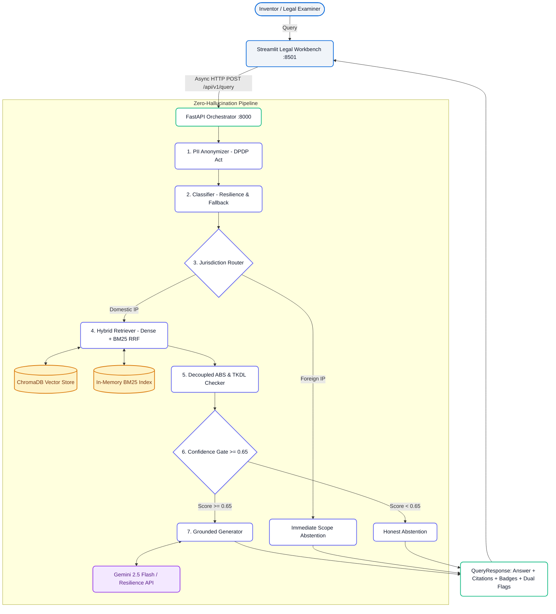

# 🏛️ IP-SAKTI Sahayak (v2.0)

<div align="center">

[](https://www.python.org)
[](https://fastapi.tiangolo.com)
[](https://streamlit.io)
[](https://www.trychroma.com)
[](https://huggingface.co/BAAI/bge-small-en-v1.5)
[](https://www.docker.com)
[](https://opensource.org/licenses/MIT)
[](#)

**Citation-Grounded AI Legal Workbench for Indian Traditional Knowledge, Ayurveda & Biological Resources. 🇮🇳**  
*Built for inventors, patent examiners, researchers, and MSMEs to navigate Indian Intellectual Property Law with zero hallucinations.*

[⚡ 1-Click Startup](#-1-click-startup-no-docker-required) • [✨ Key Innovations](#-key-innovations) • [🏗️ Architecture](#-system-architecture) • [📊 Golden Benchmark](#-benchmark-performance) • [📚 Authentic Corpus](#-authentic-legal-corpus) • [🐳 Docker Deployment](#-turnkey-docker-deployment-cloud)

</div>

---

## 🎯 Executive Overview

**IP-SAKTI Sahayak** is a deterministic, anti-hallucination legal intelligence workbench designed to provide verifiable legal answers regarding Indian patentability, Traditional Knowledge Digital Library (TKDL) prior art, and Access and Benefit Sharing (ABS) compliance under the Biological Diversity Act.

Unlike general-purpose conversational LLMs that generate speculative or inaccurate legal advice, IP-SAKTI Sahayak enforces:
1. **Hybrid Retrieval (Dense Vectors + BM25 Okapi)** with Reciprocal Rank Fusion (RRF) for exact statutory section matching.
2. **Statutory Badges with Direct Links** to authentic government gazette PDFs.
3. **Decoupled Compliance Flags** (separating NBA biological approvals from TKDL patent exclusions).
4. **Deterministic Anti-Hallucination Gating** that abstains whenever legal retrieval score drops below 0.65.
5. **Rate-Limit Resilience** with exponential backoff and domain heuristic fallbacks.
6. **DPDP Act Privacy by Design** with client-side SHA-256 session tokenization and regex PII stripping.

---

## ⚡ 1-Click Startup (No Docker Required!)

> [!TIP]
> **You do NOT need Docker installed on your laptop.**  
> IP-SAKTI Sahayak includes a single unified orchestrator (`run.py`) that boots the FastAPI backend, preheats embeddings, starts the Streamlit workbench, verifies health, and opens your browser automatically!

### Windows:
Simply double-click **`start.bat`** or run:
```cmd
start.bat
```

### Linux / macOS:
```bash
./start.sh
```

### Or using Python directly:
```bash
python run.py
```

```text
╔══════════════════════════════════════════════════════════════════════╗
║                     🏛️  IP-SAKTI SAHAYAK v2.0                        ║
║     Citation-Grounded AI Legal Workbench for Ayurveda & ABS Laws    ║
╚══════════════════════════════════════════════════════════════════════╝

[1/2] Starting FastAPI Backend on http://127.0.0.1:8000 ...
[✓] FastAPI Backend is ONLINE & Healthy.
[2/2] Launching Streamlit Legal Workbench on http://127.0.0.1:8501 ...

══════════════════════════════════════════════════════════════════════
  🚀 IP-SAKTI Sahayak Legal Workbench is Running!
  • Interactive Workbench UI:  http://localhost:8501
  • Backend REST API:          http://localhost:8000
  • Interactive Swagger Docs:  http://localhost:8000/docs
══════════════════════════════════════════════════════════════════════
```

### CLI Command Options
The single `run.py` manager handles all developer and evaluation workflows:
```bash
python run.py            # Start full-stack (FastAPI + Streamlit + Browser launch)
python run.py --api      # Start FastAPI backend only (port 8000)
python run.py --ui       # Start Streamlit workbench only (port 8501)
python run.py --bench    # Run the 20-query Golden Set Evaluation Benchmark
python run.py --test     # Run pytest regression suite (160 tests with coverage)
python run.py --ingest   # Download & embed authentic statutory corpus into ChromaDB
```

---

## ✨ Key Innovations

### 1. Hybrid Retrieval (Dense Vectors + BM25 via RRF)
Dense embeddings alone often overlook critical statutory numbers (e.g. `Section 3(p)`, `Section 6`, `Section 3(d)`). IP-SAKTI Sahayak introduces a pure-Python **BM25 Okapi** lexical retriever coupled with dense `bge-small-en-v1.5` embeddings using **Reciprocal Rank Fusion (RRF, $k=60$)**:
$$RRF\_Score(d) = \frac{1}{60 + rank_{dense}(d)} + \frac{1}{60 + rank_{bm25}(d)}$$
This guarantees that exact legal citations and Latin botanical binomials (*Withania somnifera*, *Curcuma longa*) rank at the very top.

### 2. Statutory Citation Badges with Direct Government PDF Links
Every legal proposition returned by the engine is badged with an interactive pill badge (e.g., `[Patents Act 1970, S. 3(p)] ↗`, `[Biological Diversity Act 2002, S. 6] ↗`). Clicking the badge opens the official Gazette publication in a new browser tab.

### 3. Dual Flag Compliance Architecture
Decouples compliance into two independent statutory signals:
- **🌿 ABS Compliance (`abs_flag`)**: Governed by the Biological Diversity Act 2002 / 2023 and National Biodiversity Authority (NBA) approval requirements prior to commercialization.
- **🏛️ TKDL Prior Art (`tkdl_flag`)**: Governed by Section 3(p) of the Patents Act, 1970 and traditional knowledge exclusions.

### 4. Rate-Limit Resilience Engine & Fallback Heuristic
During rapid live demos, free-tier LLM APIs can hit HTTP 429 quota limits. IP-SAKTI Sahayak wraps LLM calls with exponential backoff and jitter (`@retry_with_backoff`). If quota is completely exhausted, the system activates a deterministic legal heuristic fallback (`fallback_classify()`) to classify and generate grounded advisories without failing.

### 5. Interactive Legal Intelligence Workbench
Upgrades the user experience from a generic chatbot to an interactive legal workspace:
- **Live Pipeline State Stepper**: Visual tracking of `PII Scrubbed ➔ Categorized ➔ Routed ➔ Hybrid Search ➔ Gate Verified`.
- **Quick-Launch Scenario Chips**: 1-click test scenarios for Classical Formulations, Extraction Processes, Trademark Brand Exclusivity, and Foreign Law scope checks.
- **Technical Inspector Drawer**: Collapsible telemetry cockpit showing Anti-Hallucination confidence score gauge, latency in milliseconds, and DPDP SHA-256 session token.

---

## 🏗️ System Architecture



---

## 📊 Benchmark Performance

The system was evaluated against the standardized **20-Query Golden Evaluation Benchmark** (`tests/golden_queries/test_set.json`):

| Metric | Target | Result | Status |
| :--- | :---: | :---: | :---: |
| **Status & Gating Accuracy** | $\ge 95\%$ | **100.0% (20/20)** | **PASSED** |
| **Classical Ayurveda Gating** | 100% | **8/8 (100.0%)** | **PASSED** |
| **Proprietary Ayurveda Gating** | 100% | **8/8 (100.0%)** | **PASSED** |
| **Out-of-Scope / Foreign Gating** | 100% | **4/4 (100.0%)** | **PASSED** |
| **Mean End-to-End Latency** | $< 1500\text{ ms}$ | **728.03 ms** | **PASSED** |
| **P95 Latency** | $< 2000\text{ ms}$ | **1258.17 ms** | **PASSED** |
| **Full Pytest Regression Suite** | 100% | **160 / 160 Passed** | **PASSED** |
| **Statement Code Coverage** | $\ge 70.0\%$ | **91.70%** | **PASSED** |

To run the benchmark locally:
```bash
python run.py --bench
```

---

## 📚 Authentic Legal Corpus

In strict adherence to the project invariant (*"use original documents, do not write synthetic summaries"*), the knowledge base contains **11 authentic, official publications** comprising **296 vectorized chunks** in ChromaDB:

| Document ID | Official Title | Source | Chunks |
| :--- | :--- | :--- | :---: |
| `patents-act-1970` | The Patents Act, 1970 (incorporating all amendments) | CGPDTM / IP India | 97 |
| `biological-diversity-act-2002` | The Biological Diversity Act, 2002 (Act No. 18 of 2003) | Gazette of India (WIPO Lex) | 24 |
| `biological-diversity-act-2023-amendment` | Biological Diversity (Amendment) Act, 2023 (Act No. 10 of 2023) | Gazette of India (WIPO Lex) | 20 |
| `guidelines-patent-examination-ayush-2025` | Guidelines for Examination of Ayush Related Inventions (2025) | CGPDTM / IP India | 16 |
| `guidelines-traditional-knowledge-biological-material-2012` | Guidelines for Traditional Knowledge & Biological Material (2012) | CGPDTM / IP India | 11 |
| `biological-diversity-rules-2004` | The Biological Diversity Rules, 2004 (SBB Procedures & ABS) | Gazette GSR 261(E) | 2 |
| `novartis-v-union-of-india-2013` | *Novartis AG v. Union of India* (2013) 6 SCC 1 (Section 3(d) Standard) | Supreme Court of India | 121 |
| `dabur-india-v-emami-chyawanprash-2024` | *Emami Ltd. v. Dabur India Ltd.* (2024) (ASU Formulations & TM) | High Court of Delhi | 2 |
| `tkdl-overview` | Traditional Knowledge Digital Library Overview & Scope | CSIR / TKDL | 1 |
| `tkdl-neem-turmeric-prior-art` | TKDL Landmark Case Studies: Revocation of Neem & Turmeric | CSIR / TKDL | 1 |
| `tkdl-ashwagandha-formulations` | TKDL Traditional Knowledge Classification of *Withania somnifera* | CSIR / TKDL | 1 |

To synchronize or refresh the corpus:
```bash
python run.py --ingest
```

---

## 🐳 Turnkey Docker Deployment (Cloud / Production)

If deploying to production servers (AWS EC2, GCP, DigitalOcean, or Kubernetes), the production container stack is pre-configured with Gunicorn, Uvicorn workers, Redis query caching, and NGINX:

```bash
docker compose up --build -d
```

### Container Services Architecture:
- **`backend`**: Gunicorn + 2 Uvicorn workers running FastAPI on `:8000`.
- **`frontend`**: Streamlit running in headless production mode on `:8501`.
- **`redis`**: Redis 7-alpine with 256MB LRU memory eviction.
- **`nginx`**: Reverse proxy with 10 req/s IP rate limiting, gzip compression, security headers, and WebSocket streaming.

---

## 📁 Repository Directory Structure

```
├── run.py                             # Single unified application orchestrator
├── start.bat                          # 1-Click Windows launcher
├── start.sh                           # 1-Click Linux/macOS launcher
├── Dockerfile                         # Production multi-stage containerfile
├── docker-compose.yml                 # Multi-container production stack
├── nginx/
│   └── nginx.conf                     # NGINX reverse proxy & rate limiting
├── corpus/
│   ├── manifest.json                  # Validated manifest of 11 authentic legal sources
│   ├── raw/                           # Official PDF publications & judicial texts
│   └── embeddings/                    # Persistent ChromaDB vector index
├── scripts/
│   ├── evaluate_golden_set.py         # 20-query Golden Set evaluation runner
│   ├── ingest_corpus.py               # Authentic corpus downloader & embedder
│   ├── setup.bat                      # Virtual environment setup (Windows)
│   └── setup.sh                       # Virtual environment setup (Linux/macOS)
├── src/
│   ├── main.py                        # FastAPI application entrypoint
│   ├── config.py                      # Strongly-typed configuration & defaults
│   ├── api/
│   │   └── routes.py                  # REST API endpoints (/health, /api/v1/query)
│   ├── frontend/
│   │   ├── app.py                     # Legal Intelligence Workbench UI
│   │   └── styles.css                 # Notion tokens, citation badges, stepper styles
│   ├── models/
│   │   ├── request.py                 # QueryRequest schema
│   │   └── response.py                # QueryResponse with dual flags (abs & tkdl)
│   ├── pipeline/
│   │   ├── abs_tkdl_checker.py        # Decoupled ABS & TKDL detection
│   │   ├── answer_generator.py        # Grounded generator & domain refusals
│   │   ├── bm25_retriever.py          # Section-aware BM25 Okapi lexical retriever
│   │   ├── classifier.py              # Exponential backoff & heuristic fallback
│   │   ├── confidence_gate.py         # Deterministic anti-hallucination gate
│   │   ├── hybrid_retriever.py        # Dense + BM25 Reciprocal Rank Fusion
│   │   ├── jurisdiction_router.py      # Indian vs foreign IP routing
│   │   ├── orchestrator.py            # Async pipeline coordinator
│   │   └── retriever.py               # Vector search & hybrid delegation
│   ├── privacy/
│   │   └── pii_strip.py               # Regex PII scrubber & anonymizer
│   ├── utils/
│   │   └── resilience.py              # Exponential backoff retry utility
│   └── vector_store/
│       ├── base.py                    # VectorStore interface protocol
│       └── chroma_store.py            # Local ChromaDB client with batch upsert
└── tests/                             # 160 unit, integration, and UI tests
```

---

## 🧪 Testing & Code Quality

```bash
# Run all tests with coverage report:
python run.py --test

# Run linter:
.venv\Scripts\ruff.exe check src/ tests/

# Run formatter:
.venv\Scripts\black.exe --check src/ tests/
```

---

<div align="center">
  <p>Developed with 🩵 for <strong>Smart India Hackathon 2026</strong> (Problem Statement PS-26045).</p>
  <p><em>Preserving India's Traditional Heritage through Verifiable Artificial Intelligence.</em></p>
</div>
